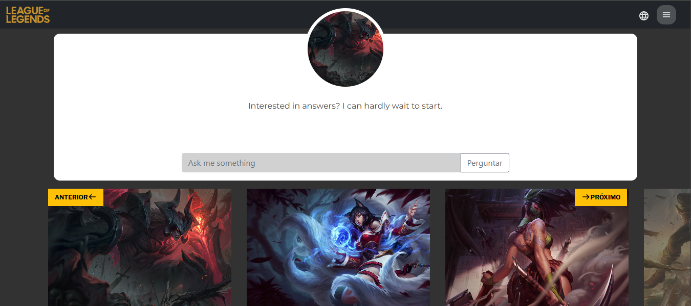
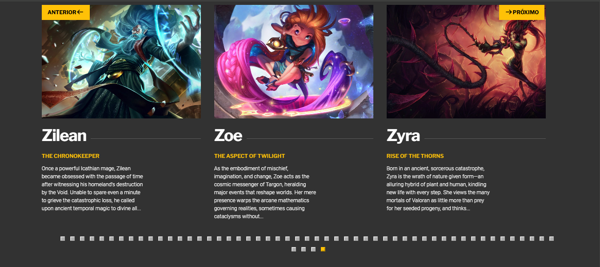

# Front-end

  

This front-end was built using the [Horizontal Timeline](https://codepen.io/davidbiek/pen/BaWYWME) theme to display League of Legends champions in a carousel format.

# Running the Application
To run the application, simply open the `index.html` file located in the project root directory.
